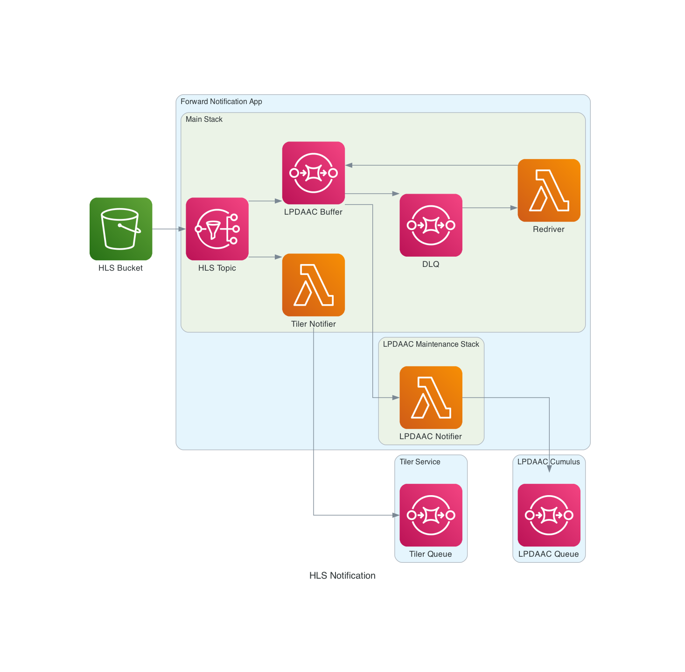

# HLS LPDAAC

System for notifying the LPDAAC about newly created HLS files.

## Architecture

The architecture is simple, but allows for pausing notifications during LPDAAC
maintenance windows.



The resources within the "Forward Notification App" box represent everything
managed by the IaaC within this repository.  The other resources are managed
elsewhere, as follows:

- **HLS Bucket:** S3 bucket where HLS-generated granules land.
- **LPDAAC Queue:** SQS queue managed by the LPDAAC's Cumulus deployment.
  Ultimately, as described below, notifications of new HLS granules appearing in
  the HLS Bucket are sent to this queue.
- **Tiler Queue:** (Production only) Tiler service queue also receiving
  notifications of new HLS granules appearing in the HLS Bucket.

The infrastucture defined by this repository manages the notifications of newly
generated HLS granules in the HLS bucket by using a very small and simple "fan
out" architecture so that notifications to both the LPDAAC and the Tiler can be
managed independently.

In particular, the motivation for this are the periodic LPDAAC maintenance
windows, where the LPDAAC asks all producers to pause sending messages to their
queue.  We address this as follows:

1. Provide a GitHub Actions workflow named "Pause LPDAAC Notifications" that
   redeployes the "LPDAAC Notification Stack" with reserved concurrent
   executions of the "LPDAAC Notifier" Lambda set to 0, which essentially
   disables sending notifications to the LPDAAC.  When the LPDAAC notifies us to
   pause notifications, we manually trigger this workflow.
1. Use the SQS queue "LPDAAC Buffer" to buffer messages during notification
   pauses.
1. Although LPDAAC maintenance windows are generally brief (typically only a few
   hours to perhaps a day), we have a Dead-Letter Queue ("DLQ" in the diagram)
   to handle exceptionally long windows, so messages are not lost.
1. Use a "Redriver" Lambda to handle messages in the "DLQ" by simply sending
   them back to the "LPDAAC Buffer" queue so we should never need to manually
   redrive messages.
1. Provide a GitHub Actions workflow named "Resuem LPDAAC Notifications" that
   redeployes the "LPDAAC Notification Stack" with reserved concurrent
   executions of the "LPDAAC Notifier" Lambda set back to the default value
   defined in the stack, which re-enables sending notifications to the LPDAAC.
   When the LPDAAC notifies us to resume notifications, we manually trigger this
   workflow, and any messages buffered in the "LPDAAC Buffer" queue are then
   sent to the LPDAAC.

This approach allows pausing LPDAAC notifications _without_ requiring a full
redeployment of the app, and _without_ impacting Tiler notifications.

## Requirements

- [pre-commit](https://pre-commit.com/)
- Python >= 3.9
- tox
- AWS CLI
- AWS IAM role with sufficient permissions for creating, destroying and modifying
  relevant stack resources
- (Optional) [Graphviz](https://graphviz.gitlab.io/download/) is necessary only
  if you need to update the architecture diagram shown above.

## Environment Settings

```plain
# AWS Short-term Access Key

export AWS_DEFAULT_REGION=us-west-2
export AWS_ACCESS_KEY_ID=<id>
export AWS_SECRET_ACCESS_KEY=<key>
export AWS_SESSION_TOKEN=<token>

# Stack variables

export HLS_LPDAAC_STACK=<stack name>
export HLS_LPDAAC_BUCKET_NAME=<source bucket name>
export HLS_LPDAAC_QUEUE_ARN=<destination queue ARN>
# Required ONLY in PROD for FORWARD processing
export HLS_LPDAAC_TILER_QUEUE_ARN=<tiler queue ARN>
export HLS_LPDAAC_MANAGED_POLICY_NAME=mcp-tenantOperator
```

## CDK Commands

In the `make` commands shown below, `<APP>` must be one of the following:

- `forward`
- `forward-it` (integration test stack)
- `historical`
- `historical-it` (integration test stack)

### Synth

Display generated cloud formation template that will be used to deploy.

```plain
make synth-<APP>
```

### Diff

Display a diff of the current deployment and any changes created.

```plain
make diff-<APP>
```

### Deploy

Deploy current version of stack:

```plain
make deploy-<APP>
```

### Destroy

Destroy current version of stack:

```plain
make destroy-<APP>
```

### Development

For active stack development run

```plain
tox -e dev -r -- version
```

This creates a local virtualenv in the directory `.venv`.
To use it for development:

```plain
source .venv/bin/activate
```

Install pre-commit hooks:

```plain
pre-commit install --install-hooks
```

The command above will make sure all pre-commit hooks configured in
`.pre-commit-config.yaml` are executed when appropriate.

To manually run the hooks to check code changes:

```plain
pre-commit run --all-files
```

The architecture diagram at the top of this document exists at
`docs/architecture.png` and was generated from `docs/architecture.py`, which
uses the [Diagrams](https://diagrams.mingrammer.com/) library.  When
`docs/architecture.py` is modified, you must regenerate `docs/architecture.png`
by running the following:

```plain
python docs/architecture.py
```

**NOTE:** This requires the virtualenv to be activated (as described above) as
well as [installing Graphviz](https://graphviz.gitlab.io/download/).

### Tests

To run unit tests:

```plain
make unit-tests
```

To run integration tests for forward processing:

```plain
make deploy-forward-it
make forward-integration-tests
make destroy-forward-it
```

To run integration tests for historical processing:

```plain
make deploy-historical-it
make historical-integration-tests
make destroy-historical-it
```
